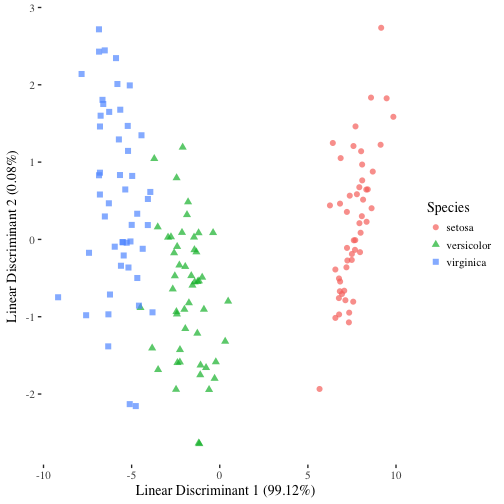
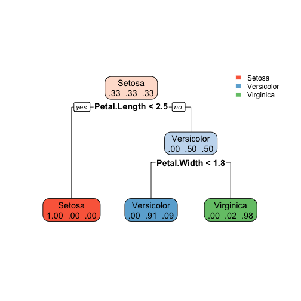

Visualization of the Iris Dataset
========================================================
author: Brynjólfur Gauti Jónsson
date: 2017-09-25
autosize: true

This reproducible slideshow is  part of a peer graded assignment in the Developing Data Products JHU coursera class.

The Iris Dataset
========================================================

This dataset was introduced by Ronald Fisher in 1936.The data set consists of 50 samples from each of three species of the Iris flower:
- Setosa 
- Versicolor 
- Virginica.

Four features were measured from each sample: the length and the width of the sepals and petals, in centimetres.

Based on the combination of these four features, Fisher developed a linear discriminant model to distinguish the species from each other. Our aim is to recreate that model.

The Shiny App
========================================================

The shiny app I produced allows the user to :
- First perform a basic exploratory analysis with graps.
- Then predict their own values using two fitted models, an LDA and a simple decision tree.

[The app can be found here](https://bgautijonsson.shinyapps.io/irisdata)

[The github repo is here](https://github.com/bgautijonsson/developdataproducts)


The Models
========================================================

An LDA was fit Ronald Fisher did and also a simple decision tree, with plots that enable users to visualize the datasets.




The Code
========================================================


The plots were generated as follows:


```r
# LDA model
ldamodel <- lda(formula = Species ~ ., data=iris, prior = c(1,1,1)/3, cv=TRUE)
# Extracting LDA linear components
predlda <- predict(ldamodel, iris)
proplda <- ldamodel$svd^2/sum(ldamodel$svd^2)
data <- data.frame(Species = iris$Species, lda = predlda$x)
# Plotting the data onto the components.
g <- ggplot(data) + geom_point(aes(lda.LD1, lda.LD2, colour=Species, shape = Species), size=2.5, alpha=0.7) + labs(x='Linear Discriminant 1 (99.12%)', y = 'Linear Discriminant 2 (0.08%)') + theme_tufte(base_size = 14)
g

# The code for the decision tree was far simpler.
model <- train(x=iris[,-5], y=iris[,5], method='rpart')
rpart.plot(x = model$finalModel, extra=4, tweak = 1.2, box.palette = list('Reds', 'Blues', 'Greens'))
```

