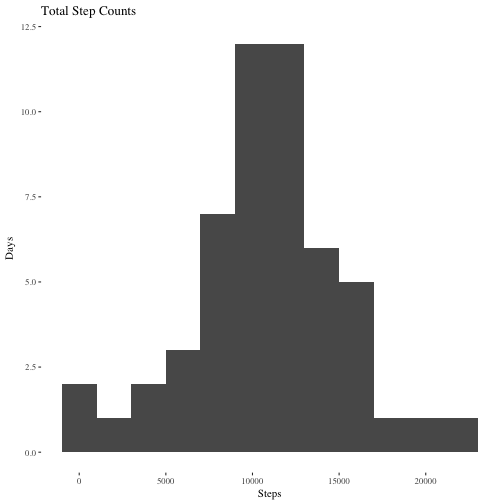
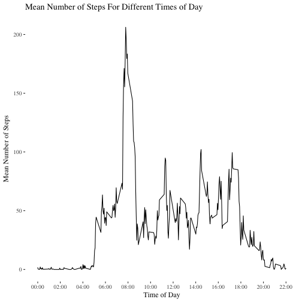
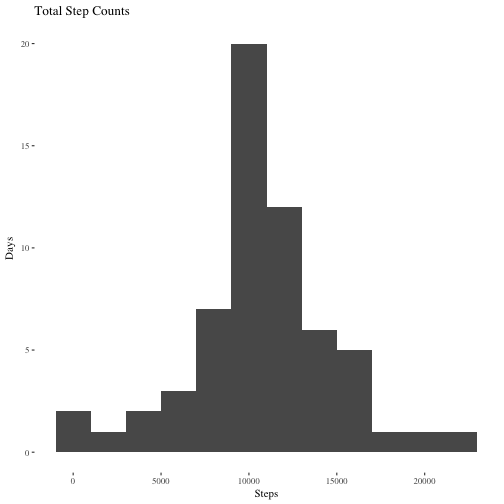
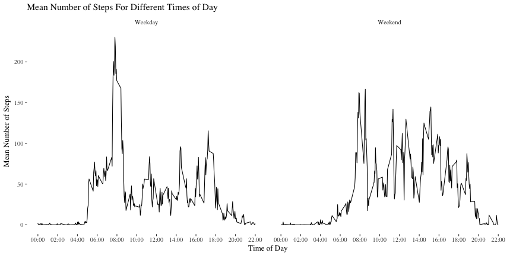

Course Project 1
=================
Brynjólfur Gauti Jónsson

Let's start by loading in the libraries we'll use.

```r
library(tidyr)
library(dplyr)
library(ggplot2)
library(stringr)
library(ggthemes)
```

# Reading and cleaning the data

### Let's start by reading in the data and looking at it.
It's stored as a csv so reading it in should be very simple. After that we'll use head and str to get a quick look at the data.

```r
data <- read.csv('activity.csv')
head(data)
```

```
##   steps       date interval
## 1    NA 2012-10-01        0
## 2    NA 2012-10-01        5
## 3    NA 2012-10-01       10
## 4    NA 2012-10-01       15
## 5    NA 2012-10-01       20
## 6    NA 2012-10-01       25
```

```r
str(data)
```

```
## 'data.frame':	17568 obs. of  3 variables:
##  $ steps   : int  NA NA NA NA NA NA NA NA NA NA ...
##  $ date    : Factor w/ 61 levels "2012-10-01","2012-10-02",..: 1 1 1 1 1 1 1 1 1 1 ...
##  $ interval: int  0 5 10 15 20 25 30 35 40 45 ...
```


### Cleaning the data

We see that the date variable is stored as a factor. Let's change it into a date.


```r
data$date <- as.Date(data$date, format = '%Y-%m-%d')
str(data)
```

```
## 'data.frame':	17568 obs. of  3 variables:
##  $ steps   : int  NA NA NA NA NA NA NA NA NA NA ...
##  $ date    : Date, format: "2012-10-01" "2012-10-01" ...
##  $ interval: int  0 5 10 15 20 25 30 35 40 45 ...
```

### Plotting the total steps per day:

We'll use ggplot for this as it's very customizable. First we have to create a vector containing the daily total steps.


```r
sum <- data %>%
    group_by(date) %>%
    summarise(sum = sum(steps)) %>%
    arrange(desc(sum))
head(sum)
```

```
## # A tibble: 6 x 2
##         date   sum
##       <date> <int>
## 1 2012-11-23 21194
## 2 2012-11-22 20427
## 3 2012-10-12 17382
## 4 2012-10-06 15420
## 5 2012-10-31 15414
## 6 2012-11-18 15110
```


```r
gghist <- ggplot(data = sum, aes(sum))
gghist + geom_histogram(na.rm = TRUE, binwidth = 2000) + theme_tufte() + 
    xlab('Steps') + ylab('Days') + ggtitle('Total Step Counts')
```



### Calculating the mean and median of steps per day:

```r
meansteps <- mean(sum$sum, na.rm=TRUE)
mediansteps <- median(sum$sum, na.rm=TRUE)
```

The mean number of steps is: 10766.19, The median is: 10765.


### Plotting a time series of the steps over intervals


```r
# Making the ticks for the x-axis
intervaltime <- str_pad(unique(data$interval), 4, pad='0')
intervaltime <- format(strptime(intervaltime, format='%H%M'), format='%H:%M')

g2 <- ggplot(data, aes(x=interval, y=steps))
g2 + stat_summary(fun.y=mean, geom='line', na.rm=TRUE) + 
    xlab('Time of Day')+
    ylab('Mean Number of Steps') + 
    ggtitle('Mean Number of Steps For Different Times of Day') +
    theme_tufte(base_size = 12) + 
    scale_x_continuous(breaks=seq(1, 2355, length.out = 12), 
                       labels=intervaltime[seq(1, 288, by=288/12)])
```



Now to find which 5-minute interval contains the largest average number of steps.


```r
means <- data %>%
    group_by(interval) %>%
    summarise(avgsteps = mean(steps, na.rm=TRUE)) %>%
    arrange(desc(avgsteps))
head(means)
```

```
## # A tibble: 6 x 2
##   interval avgsteps
##      <int>    <dbl>
## 1      835 206.1698
## 2      840 195.9245
## 3      850 183.3962
## 4      845 179.5660
## 5      830 177.3019
## 6      820 171.1509
```

The interval 835 contains the highest average of 206.1698113

## Imputing missing values

To see how many NAs are in the data lets first see where the NAs are found:
`2304, 0, 0`

```r
colSums(is.na(data))
```

```
##    steps     date interval 
##     2304        0        0
```

It seems that the only NAs are in the steps category so the number of NAs is just the number of NAs in the steps column: 2304 

### Function to impute
Now let's find a way to impute the missing values. When we have an NA in the steps variable we'll make it into the mean of steps grouped by the 5 minute interval in which the measurement would have taken place.


```r
impute <- data %>% 
    group_by(interval) %>%
    mutate_at(., 'steps',funs(replace(., which(is.na(.)), mean(.,na.rm=TRUE))))

head(impute, 10)
```

```
## # A tibble: 10 x 3
## # Groups:   interval [10]
##        steps       date interval
##        <dbl>     <date>    <int>
##  1 1.7169811 2012-10-01        0
##  2 0.3396226 2012-10-01        5
##  3 0.1320755 2012-10-01       10
##  4 0.1509434 2012-10-01       15
##  5 0.0754717 2012-10-01       20
##  6 2.0943396 2012-10-01       25
##  7 0.5283019 2012-10-01       30
##  8 0.8679245 2012-10-01       35
##  9 0.0000000 2012-10-01       40
## 10 1.4716981 2012-10-01       45
```


Now let's remake the histogram of total steps only this time with imputed values. First we have to create a new vector of total daily steps.


```r
sum2 <- impute %>%
    group_by(date) %>%
    summarise(sum = sum(steps)) %>%
    arrange(desc(sum))
head(sum)
```

```
## # A tibble: 6 x 2
##         date   sum
##       <date> <int>
## 1 2012-11-23 21194
## 2 2012-11-22 20427
## 3 2012-10-12 17382
## 4 2012-10-06 15420
## 5 2012-10-31 15414
## 6 2012-11-18 15110
```


```r
gghist2 <- ggplot(data = sum2, aes(sum))
gghist2 + geom_histogram(na.rm = TRUE, binwidth = 2000) + theme_tufte() + 
    xlab('Steps') + ylab('Days') + ggtitle('Total Step Counts')
```



```r
meanimpute <- mean(sum2$sum, na.rm=TRUE)
medianimpute <- median(sum2$sum, na.rm=TRUE)
```

The mean of imputed data is 10766.19 and the median is 10766.19. We see that the median and mean have become the same. The distribution also beacme a little more normalized by imputing it, as one might expect since we were using means to impute.

## Are there differences in activity between weekdays and weekends?

Let's make a new variable for weekday vs weekend and plot the mean number of steps for each, minutewise.

```r
impute$weekday <- weekdays(impute$date)
impute[impute$weekday %in% c('Monday', 'Tuesday', 'Wednesday', 'Thursday',
                             'Friday'),4] <- 'Weekday'
impute[impute$weekday %in% c('Saturday', 'Sunday'),4] <- 'Weekend'

g2 <- ggplot(impute, aes(x=interval, y=steps))
g2 + stat_summary(fun.y=mean, geom='line', na.rm=TRUE) + xlab('Time of Day') +
    ylab('Mean Number of Steps') + 
    ggtitle('Mean Number of Steps For Different Times of Day') +
    theme_tufte(base_size = 13) +
    scale_x_continuous(breaks=seq(1, 2355, length.out = 12), 
                       labels=intervaltime[seq(1, 288, by=288/12)]) +
    facet_grid(. ~ weekday)
```




