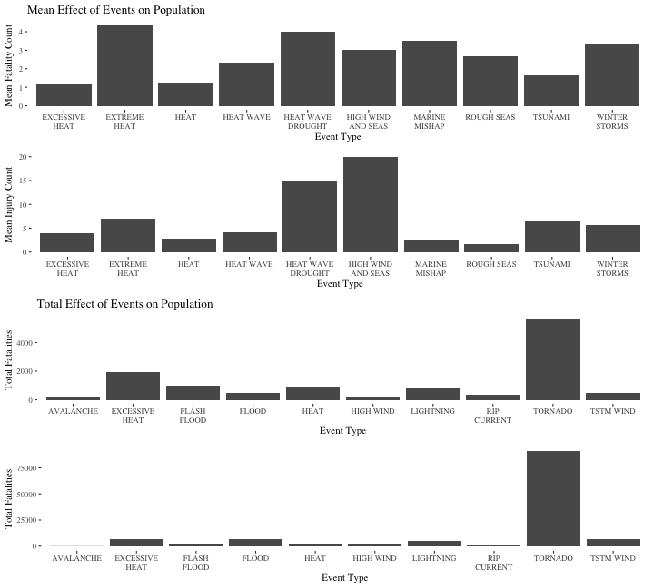
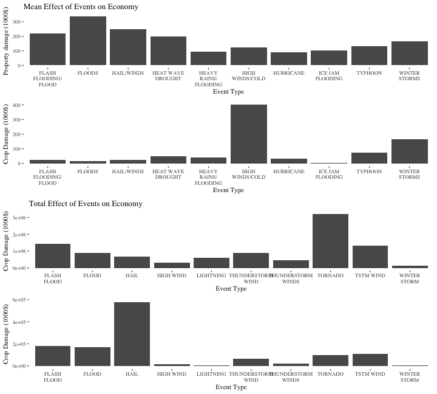
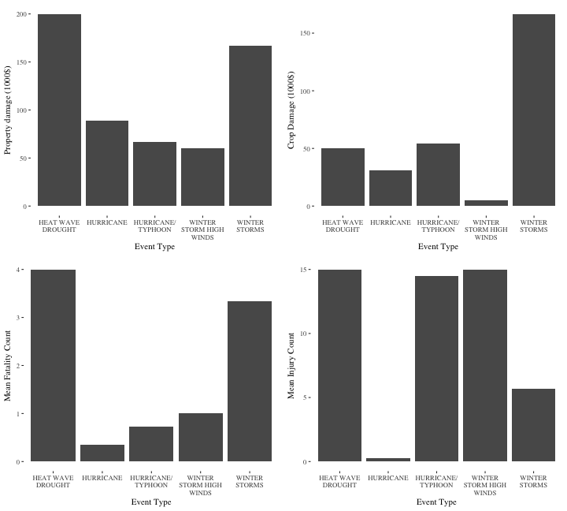

---
output:
  html_document: default
  pdf_document: default
---
The Economic and Population Effects of Different Types of Weather Events
=================
Brynjólfur Gauti Jónsson

# Synopsis
Weather events can have disastrous consequences if we are ill prepared. Heat waves can cause loss of life and floods can cause property damage. If we had reliable information which ranked the different types of events, the government could choose where to spend their budget the most efficiently. The purpose of this analysis is to see which types of events cause the biggest population and property damage. I will look at the mean and total amount of damage caused by major events and plot them for easy viewing.

# Data Processing
## Loading and Processing the Raw Data
The database we work with is obtained and kept up to date by the National Climatic Data Center (NCDC). The NCDC receives the data from the National Weather Service who receive their data from a variety of sources.

The dataset was originally downloaded 11. september, 2017. I downloaded it into a temporary file and read it from that file into RStudio. 

```r
temp <- tempfile()
download.file('https://d396qusza40orc.cloudfront.net/repdata%2Fdata%2FStormData.csv.bz2', temp)
data <- read.csv(temp)
```
Let's see what variables the data contains.

```r
dim(data)
```

```
## [1] 902297     37
```

```r
names(data)
```

```
##  [1] "STATE__"    "BGN_DATE"   "BGN_TIME"   "TIME_ZONE"  "COUNTY"    
##  [6] "COUNTYNAME" "STATE"      "EVTYPE"     "BGN_RANGE"  "BGN_AZI"   
## [11] "BGN_LOCATI" "END_DATE"   "END_TIME"   "COUNTY_END" "COUNTYENDN"
## [16] "END_RANGE"  "END_AZI"    "END_LOCATI" "LENGTH"     "WIDTH"     
## [21] "F"          "MAG"        "FATALITIES" "INJURIES"   "PROPDMG"   
## [26] "PROPDMGEXP" "CROPDMG"    "CROPDMGEXP" "WFO"        "STATEOFFIC"
## [31] "ZONENAMES"  "LATITUDE"   "LONGITUDE"  "LATITUDE_E" "LONGITUDE_"
## [36] "REMARKS"    "REFNUM"
```


We are not interested in all of the data, we only want the variables that concern population and property damage. Thus we will grab a subset of the data containing only the variables we need.

```r
smalldata <- data[, c(8, 23, 24, 25, 27)]
names(smalldata)
```

```
## [1] "EVTYPE"     "FATALITIES" "INJURIES"   "PROPDMG"    "CROPDMG"
```

\newpage
### Before we go any further, let's load the relevant packages we'll be using:


```r
suppressMessages(library(dplyr))
suppressMessages(library(tidyr))
suppressMessages(library(ggplot2))
suppressMessages(library(ggthemes))
suppressMessages(library(gridExtra))
suppressMessages(library(stringr))
```

# Exploratory analysis

Now let's start out by looking at the mean effect of each type of event. We arrange the data by each variable one at a time and grab four tables, each containing the 100 top contenders for their respective measurement.


```r
means <- smalldata %>%
    group_by(EVTYPE) %>%
    summarise(meanfat=mean(FATALITIES), meaninj=mean(INJURIES), 
              meanprop=mean(PROPDMG), meancrop=mean(CROPDMG))
meanfatal <- arrange(means, desc(meanfat))[1:100,c(1,2)]
meaninj <- arrange(means, desc(meaninj))[1:100,c(1,3)]
meanprop <- arrange(means, desc(meanprop))[1:100,c(1,4)]
meancrop <- arrange(means, desc(meancrop))[1:100,c(1,5)]

cbind(head(meaninj, 10), head(meanfatal, 10))
```

```
##                     EVTYPE  meaninj                     EVTYPE   meanfat
## 1                Heat Wave 70.00000 TORNADOES, TSTM WIND, HAIL 25.000000
## 2    TROPICAL STORM GORDON 43.00000              COLD AND SNOW 14.000000
## 3               WILD FIRES 37.50000      TROPICAL STORM GORDON  8.000000
## 4            THUNDERSTORMW 27.00000      RECORD/EXCESSIVE HEAT  5.666667
## 5       HIGH WIND AND SEAS 20.00000               EXTREME HEAT  4.363636
## 6          SNOW/HIGH WINDS 18.00000          HEAT WAVE DROUGHT  4.000000
## 7          GLAZE/ICE STORM 15.00000             HIGH WIND/SEAS  4.000000
## 8        HEAT WAVE DROUGHT 15.00000              MARINE MISHAP  3.500000
## 9  WINTER STORM HIGH WINDS 15.00000              WINTER STORMS  3.333333
## 10       HURRICANE/TYPHOON 14.48864        Heavy surf and wind  3.000000
```

```r
cbind(head(meancrop, 10), head(meanprop, 10))
```

```
##                   EVTYPE meancrop                         EVTYPE meanprop
## 1  DUST STORM/HIGH WINDS 500.0000                COASTAL EROSION      766
## 2           FOREST FIRES 500.0000           HEAVY RAIN AND FLOOD      600
## 3  TROPICAL STORM GORDON 500.0000         RIVER AND STREAM FLOOD      600
## 4        HIGH WINDS/COLD 401.0000                      Landslump      570
## 5        HURRICANE FELIX 250.0000          BLIZZARD/WINTER STORM      500
## 6         River Flooding 241.3680                   FLASH FLOOD/      500
## 7          WINTER STORMS 166.6667 FLASH FLOODING/THUNDERSTORM WI      500
## 8      EXCESSIVE WETNESS 142.0000              FLOOD/RIVER FLOOD      500
## 9           Frost/Freeze 100.0000                  FROST\\FREEZE      500
## 10               TYPHOON  75.0000            HEAVY PRECIPITATION      500
```

So we get a good first look at the data we need. One thing to keep in mind is that there are two named hurricanes there, Gordon and Felix. Single named occurrences will dominate the data if we're looking at means, but let's let them go for now.

\newpage

We do the same for the total measurements instead of means. We should see more events that occur often with less catastrophic effects since their measurements woul be washed out if we only looked at means.


```r
sums <- smalldata %>%
    group_by(EVTYPE) %>%
    summarise(sumfat=sum(FATALITIES), suminj=sum(INJURIES), 
              sumprop=sum(PROPDMG), sumcrop=sum(CROPDMG))
sumfat <- arrange(sums, desc(sumfat))[1:100, c(1,2)]
suminj <- arrange(sums, desc(suminj))[1:100, c(1,3)]
sumprop <- arrange(sums, desc(sumprop))[1:100, c(1,4)]
sumcrop <- arrange(sums, desc(sumprop))[1:100, c(1,5)]

cbind(head(suminj, 10), head(sumfat, 10))
```

```
##               EVTYPE suminj         EVTYPE sumfat
## 1            TORNADO  91346        TORNADO   5633
## 2          TSTM WIND   6957 EXCESSIVE HEAT   1903
## 3              FLOOD   6789    FLASH FLOOD    978
## 4     EXCESSIVE HEAT   6525           HEAT    937
## 5          LIGHTNING   5230      LIGHTNING    816
## 6               HEAT   2100      TSTM WIND    504
## 7          ICE STORM   1975          FLOOD    470
## 8        FLASH FLOOD   1777    RIP CURRENT    368
## 9  THUNDERSTORM WIND   1488      HIGH WIND    248
## 10              HAIL   1361      AVALANCHE    224
```

```r
cbind(head(sumcrop, 10), head(sumprop, 10))
```

```
##                EVTYPE   sumcrop             EVTYPE   sumprop
## 1             TORNADO 100018.52            TORNADO 3212258.2
## 2         FLASH FLOOD 179200.46        FLASH FLOOD 1420124.6
## 3           TSTM WIND 109202.60          TSTM WIND 1335965.6
## 4               FLOOD 168037.88              FLOOD  899938.5
## 5   THUNDERSTORM WIND  66791.45  THUNDERSTORM WIND  876844.2
## 6                HAIL 579596.28               HAIL  688693.4
## 7           LIGHTNING   3580.61          LIGHTNING  603351.8
## 8  THUNDERSTORM WINDS  18684.93 THUNDERSTORM WINDS  446293.2
## 9           HIGH WIND  17283.21          HIGH WIND  324731.6
## 10       WINTER STORM   1978.99       WINTER STORM  132720.6
```

So tornados have had a huge effect throughout history but they didn't show up on the top of the means lists. It seems that although tornadoes occur often, they don't cause a high mean amount of damage.

Now we're going to make some plots. Let's remove the uniquely named occurences from the list of means before we proceed.

```r
names <- means[c(grep("TROPICAL STORM ",means$EVTYPE), grep("HURRICANE ", means$EVTYPE)), 1]
meanfatal <- meanfatal[!(meanfatal$EVTYPE %in% names$EVTYPE),]
meaninj <- meaninj[!(meaninj$EVTYPE %in% names$EVTYPE),]
meanprop <- meanprop[!(meanprop$EVTYPE %in% names$EVTYPE),]
meancrop <- meancrop[!(meancrop$EVTYPE %in% names$EVTYPE),]
```

\newpage

## Creating the plots


```r
# Population plot
meanpop <- arrange(merge(meanfatal, meaninj, by ='EVTYPE'), desc(meanfat))
sumpop <- arrange(merge(sumfat, suminj, by = 'EVTYPE'), desc(sumfat))
gpop <- ggplot(meanpop[1:10,]) + xlab('Event Type') + theme_tufte() +
    scale_x_discrete(labels = function(x) str_wrap(x, width = 10))
gsumpop <- ggplot(sumpop[1:10,]) + xlab('Event Type') + theme_tufte() +
    scale_x_discrete(labels = function(x) str_wrap(x, width = 10))
gfat <- gpop + geom_col(aes(x = EVTYPE, y = meanfat)) + 
    ylab('Mean Fatality Count') + ggtitle('Mean Effect of Events on Population')
ginj <- gpop + geom_col(aes(x = EVTYPE, y = meaninj)) + ylab('Mean Injury Count')
gsumfat <- gsumpop + geom_col(aes(x=EVTYPE, y=sumfat)) + 
    xlab('Event Type') + ylab('Total Fatalities') +
    ggtitle('Total Effect of Events on Population')
gsuminj <- gsumpop + geom_col(aes(x=EVTYPE, y=suminj)) + 
    xlab('Event Type') + ylab('Total Fatalities')

# Economy plot
meaneco <- arrange(merge(meanprop, meancrop, by = 'EVTYPE'), desc(meanprop))
sumeco <- arrange(merge(sumprop, sumcrop, by='EVTYPE'), desc(sumprop))
geco <- ggplot(meaneco[1:10,]) + xlab('Event Type') + theme_tufte() +
    scale_x_discrete(labels = function(x) str_wrap(x, width = 10))
gsumeco <- ggplot(sumeco[1:10,]) + xlab('Event Type') + theme_tufte() +
    scale_x_discrete(labels = function(x) str_wrap(x, width = 10))
gprop <- geco + geom_col(aes(x=EVTYPE, y=meanprop)) + 
    ylab('Property damage (1000$)') + 
    ggtitle('Mean Effect of Events on Economy')
gcrop <- geco + geom_col(aes(x=EVTYPE, y=meancrop)) + 
    ylab('Crop Damage (1000$)')
gsumprop <- gsumeco + geom_col(aes(x=EVTYPE, y=sumprop)) + 
    ylab('Crop Damage (1000$)') + 
    ggtitle('Total Effect of Events on Economy')
gsumcrop <- gsumeco + geom_col(aes(x=EVTYPE, y=sumcrop)) + 
    ylab('Crop Damage (1000$)')

# Summary Plot
meanall <- merge(meaneco, meanpop, by = 'EVTYPE')
gall <- ggplot(meanall[1:5,]) + xlab('Event Type') + theme_tufte() +
    scale_x_discrete(labels = function(x) str_wrap(x, width = 10))
gpropall <- gall + geom_col(aes(x=EVTYPE, y=meanprop)) + 
    ylab('Property damage (1000$)')
gcropall <- gall + geom_col(aes(x=EVTYPE, y=meancrop)) + 
    ylab('Crop Damage (1000$)')
gfatall <- gall + geom_col(aes(x = EVTYPE, y = meanfat)) + ylab('Mean Fatality Count')
ginjall <- gall + geom_col(aes(x = EVTYPE, y = meaninj)) + ylab('Mean Injury Count')
```

\newpage

#Results
## Which Events Have the Greatest Effect on Populaiton
We made a table where we selected the events that scored highly on both injuries and fatalities. Now we will plot the ten most destructive events ranked by number of fatalities.

```r
grid.arrange(gfat, ginj, gsumfat, gsuminj, ncol = 1)
```



Looking at the means, it seems that the most dangerous weather event is high heat and events that follow heat waves. We also see winter storms, so we've got both extremes of hot and cold weather. After that we see that many weather related deaths and injuries are attributed to the sea, which makes sense since a huge amount of the population works at sea. 

From the plot of the totals, we see that tornadoes have caused a huge amount of lifeloss and injuries throughout history but not on average. So we might assume that has something to do with how well the different places are prepared for them.


\newpage

## Which Events Have the Greates Effect on Economy

Next we did the same for property and crops damage. We grabbed the events that caused a lot of damage on both property and crops. Now we will show the top ten contenders ranked by property and crops damage.

```r
grid.arrange(gprop, gcrop, gsumprop, gsumcrop, ncol=1)
```



The plots on the economic consequenses show a lot of events concernig rain, floods and water. Since water flooding into buildings can cause a large amount of damage in dollars it makes sense that those typed of events historically cause a lot of damage. We also see tornadoes here. If a tornado causes damage to a property at all it's probably causing a lot at once, so the amount of dollars should stack up over time.


\newpage

# Which Events Have a Big Effect on Both Population Health and Economy
Then we merged together the two newly created tables, meaneco and meanpop, containing the top contenders for population and property damage respectively.

```r
grid.arrange(gpropall, gcropall, gfatall, ginjall, ncol = 2)
```



These are the events that cause a lot of property damage and are a high risk to the population. If the government were to choose any events from which to strengthen their safeguards, the above would be safe bets.

